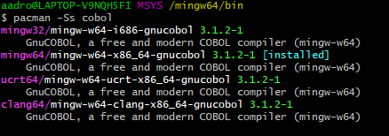
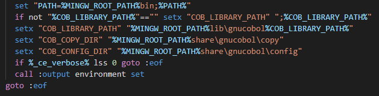
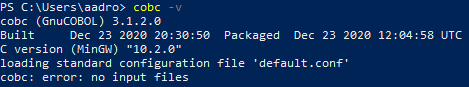

# COBOL-85 Repo

## Install gnucobol. Windows 10.

Follow this steps:

1. Install [MSYS2](https://www.msys2.org/).

2. Install thoroughly the gcc compiler via MSYS2 terminal. This may take some minutes. Execute:

    > pacman -S --needed base-devel mingw-w64-x86_64-toolchain

3. Install gnucobol. To list the available packages use:
    
    > pacman -Ss cobol.

    

    1. I chose the second one because of my architecture. You may want to choose a different one. 

    > pacman -S --needed base-devel mingw-w64-x86_64-gnucobol

4. (May not be necessary) Configure gnucobol.

    1. Again as for my installation that means to execute `cobenv.cmd`, to be found here:

        > C:\msys64\mingw64\bin\cobenv.cmd

    2. You may want those enviormental variables to persist, namely, `COB_CONFIG_DIR`, `COB_COPY_DIR` and `COB_LIBRARY_DIR`. One way to do that is to replace those `set` lines by `setx`. For instance:

        

To this point the compiler should be ready to perform its duty.

## Install gnucobol. Linux.

Notice that these steps ought to be similar to the ones used for Windows. Take into account your architecture, `base-devel` was mine. Moreover, you may consider executing `cobenv.sh` instead of `.cmd` whenever you ought to configure gnucobol.

## Cobol hello-world.

The first 6th characters are reserved, as well as, the 7th. Both, have specific purposes. Section A (that's how being called) immidiately follows, Section B comprises around 60 characters, until the 73d character. There is still one section to mention at the end, that is for punched cards and, fortunately, is deprecated. Write:

        IDENTIFICATION DIVISION.
        PROGRAM-ID. HELLO-WORLD.

        PROCEDURE DIVISION.
            DISPLAY "HELLO WORLD!".

        STOP RUN.

## Compile with gnucobol.

There is out there a lot of documentation in reference to this same topic. Therefore, I am not going to pretend to extend it, but to point out the basics. Execute the following command:

 ```cobc -v```

If gnucobol was properly installed, it should be returning this:



To compile a program execute:

```cobc -x hello-world.cob -o hello-world```

You'll recieve a brand new exec file.

You can compile and then link the different files (`.o` extensions) by calling:

We can determine the standard with `std=` for instance:

```cobc -std=cobol85 -x hello-world.cob -o hello-world```

## COBOL Language reference.

I guess, a reliable (but not a good one) source of information, must be found in IBM: [cobol language reference.](https://www.ibm.com/docs/en/SS6SG3_4.2.0/com.ibm.entcobol.doc_4.2/PGandLR/igy3lr50.pdf)

Another one: [developer docs cobol.](https://devdocs.io/gnu_cobol/)
 